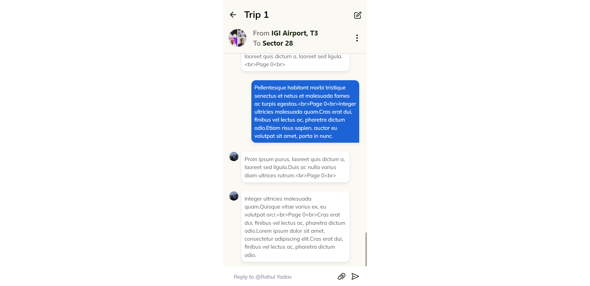

# Chat Screen PWA - CoRider Assignment Submission

## Assignment Overview

**Assignment:** Develop a Progressive Web Application (PWA) using ReactJS to build a Chat Screen for both Android and iOS devices.

**Assignment Goals:**

-   Create a single-page PWA with a specific UI layout.
-   Fetch chat data from the provided API.
-   Implement infinite scrolling of chats.

## Table of Contents

1. [Project Overview](#project-overview)
2. [Screenshots](#screenshots)
3. [Features](#features)
4. [Technologies Used](#technologies-used)
5. [Packages Used](#packages-used)
6. [Getting Started](#getting-started)
7. [Usage](#usage)
8. [Deployment](#deployment)
9. [Author](#author)

## Project Overview

Chat Screen PWA is a Progressive Web Application developed with ReactJS that mimics the behavior of a typical chat application chat screen found on Android and iOS devices. The application fetches chat messages from an external API and provides features such as infinite scrolling and an intuitive user interface.

## Screenshots



## Features

-   **Infinite Scrolling:** Load older chat messages automatically as you scroll, providing a seamless chat experience.

-   **Message Caching:** Cache previously loaded messages to enable offline access.

-   **Group Name Editing:** Users can edit their group name by clicking on the edit icon.

-   **Responsive Design:** The application is fully responsive, ensuring a consistent user experience on various devices.

-   **Installable PWA:** The application can be installed on Android and iOS devices, just like any other PWA.

-   **Custom Scrollbar:** Added a custom scrollbar which compliments the overall design.

-   **Beautiful UI:** The UI is designed to match the UI designed by CoRider team.

## Technologies Used

-   [React](https://react.dev/): Used for building the user interface and managing application state.
-   [TypeScript](https://www.typescriptlang.org/): Ensured type safety throughout the project.
-   [Chakra UI](https://chakra-ui.com/): Used for UI components, ensuring a modern and accessible design.
-   [Axios](https://axios-http.com/): Used for making HTTP requests to fetch chat data.
-   [Workbox](https://developers.google.com/web/tools/workbox): Implemented service worker and caching for offline access.

## Packages used

-   [React-infinite-scroll-component](https://www.npmjs.com/package/react-infinite-scroll-component)

## Getting Started

To run Chat Screen PWA locally, follow these steps:

1. Clone the repository:

```bash
  git clone https://github.com/Shivam-Sharma-1/CoRider-Assignment.git
```

2. Navigate to the project directory

```bash
  cd corider-assignment
```

3. Install the dependencies:

```bash
  npm install
  # or
  yarn install
```

4. Start the development server:

```bash
  npm start
  # or
  yarn start
```

The application should now be running on `http://localhost:3000`

## Usage

To use the application, follow these steps:

1. Open the application in your web browser.

2. Click the kebab icon (three dots) or attachment icon to access additional options.

3. Scroll up to load older chat messages automatically.

4. Edit group name by clicking on the edit icon.

## Deployment

This pwa is deployed using using Vercel  
Website url: https://co-rider-assignment-shivam-sharma.vercel.app/

## Author

-   [@Shivam-Sharma-1](https://github.com/Shivam-Sharma-1)
